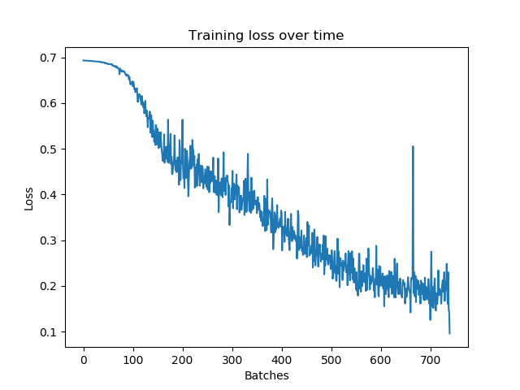
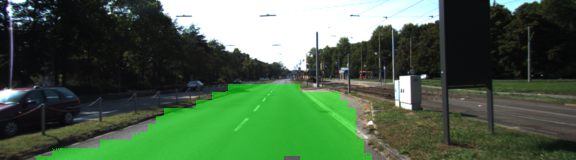
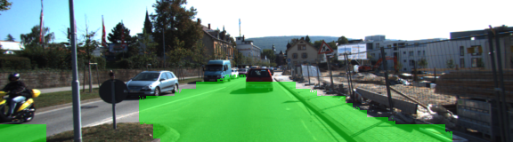
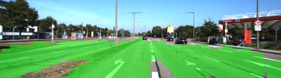
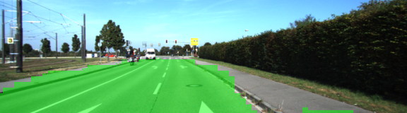

## Semantic Segmentation Project

Yangchun Luo<br>
July 29, 2018

This is the assignment for Udacity's Self-Driving Car Term 3 Project 2.

---

The goal of this project is to label the pixels of a road in images using a Fully Convolutional Network (FCN).

### To run

```bash
python main.py
```

Other setup information can be found in the original [README](README-orig.md) file.

### Train loss

Training loss is decreasing over time, as shown the plot below. (plotted by `plot_training_loss.py` based on [training.log](training.log))



### Results







